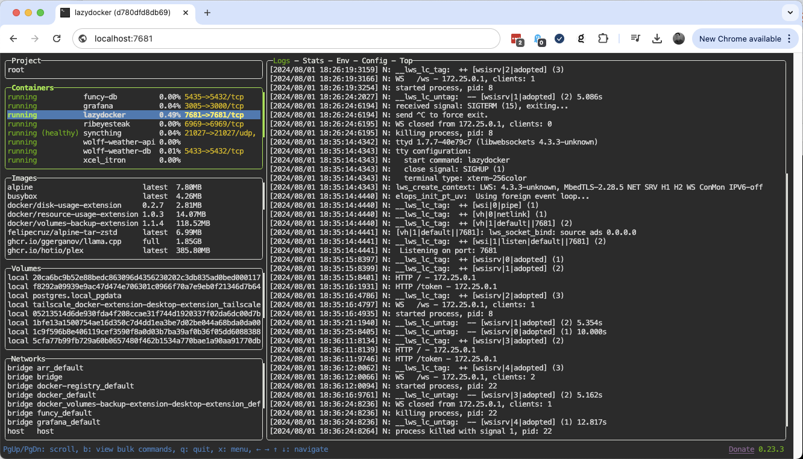

# lazydocker-web
> Run `lazydocker` in a Docker container and serve output over http using `ttyd`

## Run
- `git clone https://github.com/mattpowell/lazydocker-web.git`
- `cd lazydocker-web`
- `docker compose up -d`

## References
- [lazydocker](https://github.com/jesseduffield/lazydocker)
- [ttyd](https://github.com/tsl0922/ttyd)
